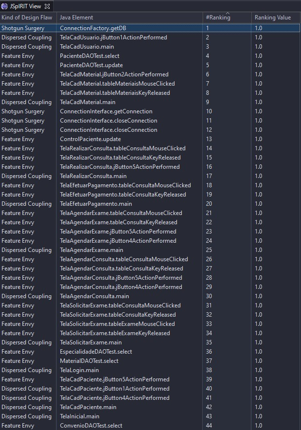
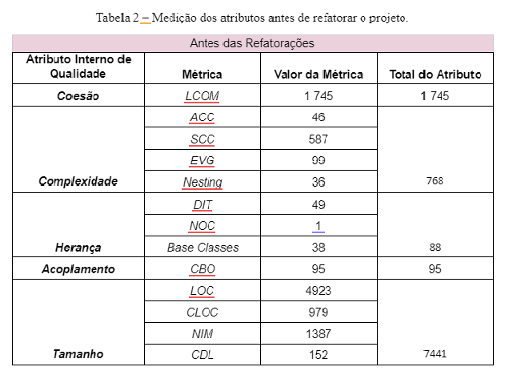
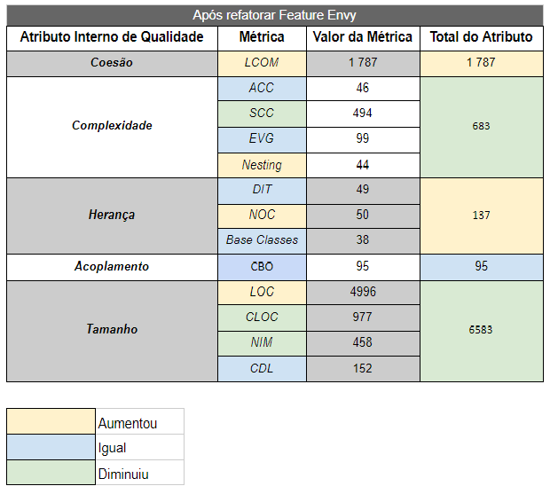
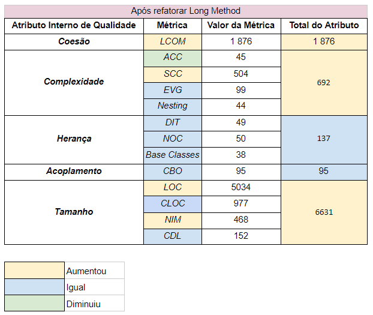
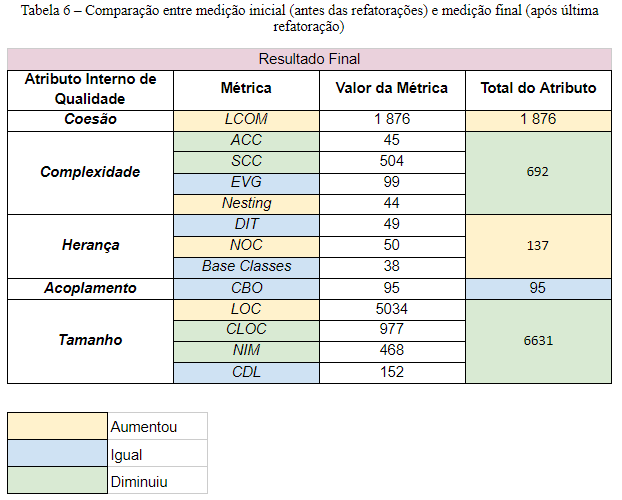
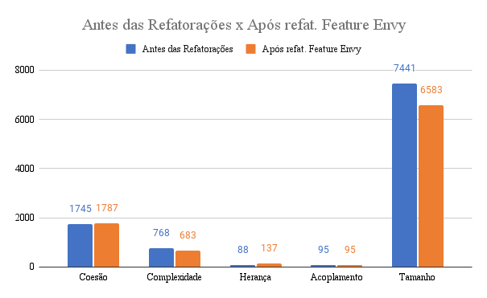
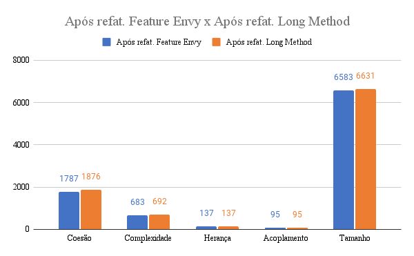
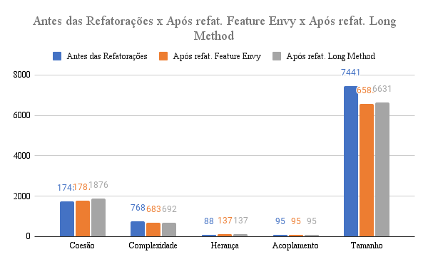

<h1> Qualidade de Software </h1>

Trabalho final da disciplina de qualidade de Software 2021.1

## 🚀 Descrição do trabalho

O principal objetivo do trabalho, é identificar e refatorar 40 Code smells. Para isso foi utilizado um repositório open source do Github, disponível [aqui](https://github.com/Eddusr/ProjetoEngSoft3). 

## 🤢 Code Smells

Code smells são problemas encontrados no código fonte de uma aplicação e que podem interferir ou não no funcionamento da mesma.
Existem vários tipos e métodos para resolvê-los.

## 🔨 Ferramentas

- [VS Code](https://code.visualstudio.com/)
  > O Visual Studio Code foi utilizado principalmente na hora da refatoração e criação do README do repositório. Com sua infinidade de extensões, pode facilitar e muito nossa vida na hora de refatorar os code smells.
- [Eclipse](https://www.eclipse.org/downloads/)
  > O Eclipse foi utilizado durante a identificação dos code smells.
- [JDeodorante](https://github.com/tsantalis/JDeodorant)
  > Ferramenta alternativa utilizada para identificação dos code smells após a primeira ferramenta apresentar problemas de funcionamento.
- [JSpIRIT](https://github.com/graphhopper/jsprit)
  > Ferramenta utlizada na identificação dos code smells, apresentou problemas após alguns usos e por isso foi substituída pela extensão JDeodorant.
- [Live Share](https://visualstudio.microsoft.com/pt-br/services/live-share/)
  > Live Share é uma extensão disponível para o VS Code onde é possível compartilhar wokspaces de trabalho e fazer pair programming.
- [Understand](https://meteonic.com/understand)
  > Ferramenta utilizada para fazer a medição dos atributos de qualidade do sistema

## 🧐 Code smells identificados

## 📏 Medição

Foi utilizado a ferramenta Understand para realização da medição dos atributos de qualidade interna:

- Coesão
- Complexidade
- Herança
- Acomplamento
- Tamanho

### Medição antes das refatorações

### Medição após refatorar Feature Envy

### Medição após refatorar Long Method

## Comparação das Medições

Comparações com dados obtidos antes e depois das refatorações.

### Sem refatoração x Refatoração de Feature Envy

### Refatoração de Feature Envy x Long Method

### Refatoração de Long Method x Sem refatoração

## 🎉 Considerações finais
Podemos observar que a coesão e a herança aumentaram a medida que os os code smells eram refatorados. A complexidade e o tamanho diminuíram e o acoplamento não sofreu alterações.